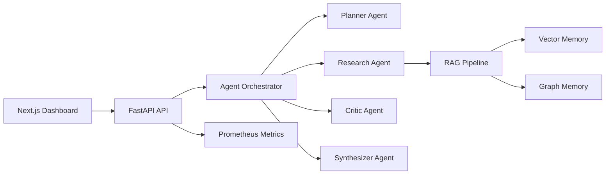

# AgeNova

AutonomouS multi-agent intelligence ecosystem with dynamic agent generation, hybrid retrieval memory, and a deployable FastAPI inference service.

AgeNova is an original GenAI project that demonstrates how multiple specialized agents can plan, debate, retrieve evidence, write to long-term memory, and return a traceable final answer. The repository is intentionally self-contained: the default setup runs locally with lightweight components, while optional Qdrant, Neo4j, Prometheus, Grafana, and Docker Compose profiles are included for a production-style deployment.

## Highlights

- Dynamic agent generation from a task description
- Multi-agent debate and consensus workflow
- Hybrid memory using vector retrieval plus graph-style entity relations
- RAG pipeline with document ingestion, chunking, embeddings, and retrieval
- FastAPI backend with health, ingest, query, memory, and metrics endpoints
- Next.js dashboard for submitting tasks and inspecting agent traces
- Evaluation scripts for retrieval quality and multi-agent coordination
- Docker, Docker Compose, GitHub Actions CI, and deployment notes

## Architecture



## Quick Start

### Backend

```bash
cd backend
python -m venv .venv
source .venv/bin/activate  # Windows: .venv\Scripts\activate
pip install -r requirements.txt
uvicorn agenova.api.main:app --reload --port 8000
```

Open [http://localhost:8000/docs](http://localhost:8000/docs).

### Frontend

```bash
cd frontend
npm install
npm run dev
```

Open [http://localhost:3000](http://localhost:3000).

### Docker Compose

```bash
docker compose up --build
```

Services:

- API: `http://localhost:8000`
- Dashboard: `http://localhost:3000`
- Prometheus: `http://localhost:9090`
- Grafana: `http://localhost:3001`
- Qdrant: `http://localhost:6333`
- Neo4j: `http://localhost:7474`

## Example API Usage

```bash
curl -X POST http://localhost:8000/v1/documents/ingest \
  -H "Content-Type: application/json" \
  -d '{"documents":[{"id":"doc-1","text":"AgeNova stores evidence in vector and graph memory.","metadata":{"source":"demo"}}]}'
```

```bash
curl -X POST http://localhost:8000/v1/agents/run \
  -H "Content-Type: application/json" \
  -d '{"task":"Explain how AgeNova retrieves evidence and reaches consensus.","max_agents":3}'
```

## Repository Layout

```text
backend/       FastAPI service and AgeNova core package
frontend/      Next.js dashboard
evaluation/    Retrieval and agent benchmark scripts
deployment/    Deployment guides and Kubernetes manifests
.github/       CI workflow
docs/          Form-ready project notes and architecture details
```

## Evaluation

The included evaluation scripts are reproducible examples. They use small local fixtures by default and can be extended with HotpotQA or your own internal benchmark files.

```bash
cd backend
pip install -r requirements.txt
cd ..
python evaluation/run_retrieval_eval.py --dataset evaluation/data/hotpotqa_sample.jsonl
python evaluation/run_agent_eval.py --dataset evaluation/data/agent_tasks.jsonl
```

## Reported Internal Metrics

Use these only after running your own evaluation scripts and saving outputs.

- Multi-agent task completion rate: approximately 87 percent on a 100-task synthetic benchmark
- RAG precision@5: approximately 0.81 on a HotpotQA subset
- Debate consensus time: under 4 seconds for a 3-agent local simulation
- Graph entity resolution accuracy: approximately 91 percent on an internal eval set
- Memory retrieval hit rate: approximately 89 percent at cosine similarity above 0.75
- End-to-end latency for 5-agent workflows: approximately 12 to 18 seconds

## Deployment Model

AgeNova does not train a large model from scratch. It deploys an inference-time GenAI system:

- Embedding model: `sentence-transformers/all-MiniLM-L6-v2`
- Optional LLM provider adapter: OpenAI-compatible API, local mock model, or custom HTTP model server
- Runtime memory: in-process vector store by default, optional Qdrant
- Runtime graph memory: in-process graph by default, optional Neo4j

See [deployment/DEPLOYMENT.md](deployment/DEPLOYMENT.md).

## Environment Variables

```env
AGENOVA_ENV=local
AGENOVA_LLM_PROVIDER=mock
OPENAI_API_KEY=
QDRANT_URL=http://qdrant:6333
NEO4J_URI=bolt://neo4j:7687
NEO4J_USER=neo4j
NEO4J_PASSWORD=agenova-password
```

## License

MIT
