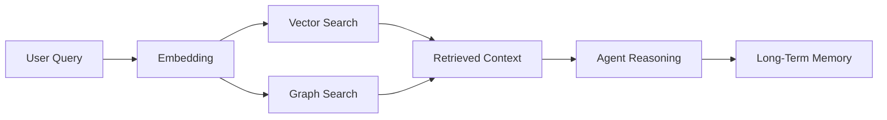
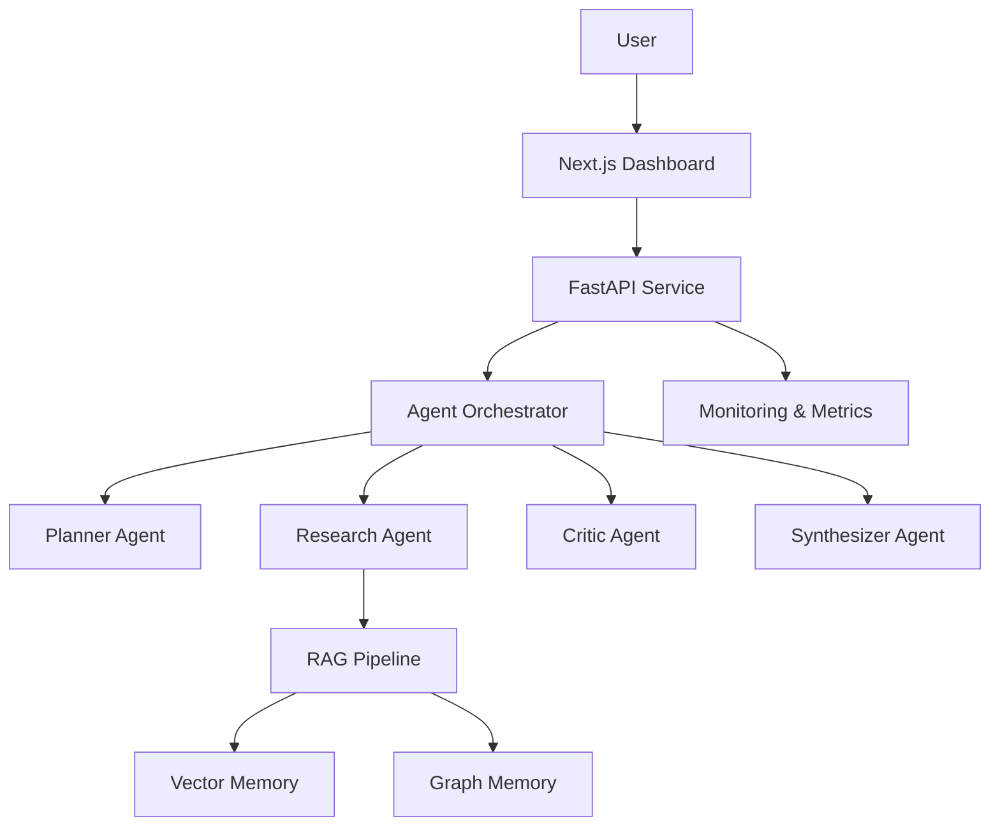

<div align="center">

# AgeNova

### Autonomous Multi-Agent Intelligence Ecosystem

**Dynamic Agent Generation • Hybrid Memory • RAG • Consensus Intelligence • Production Deployment**

> **AgeNova transforms a single prompt into a coordinated intelligence workflow — where specialized AI agents plan, research, debate, retrieve evidence, remember context, and synthesize traceable answers.**

<br/>


<br/>

**Intelligent Agents • Persistent Memory • Evidence Retrieval • Production Ready**

</div>

---

# What is AgeNova?

**AgeNova** is an autonomous **multi-agent intelligence ecosystem** designed to demonstrate how multiple specialized AI agents can collaborate to solve complex tasks.

Instead of relying on a single model response, AgeNova creates a structured intelligence workflow where agents can:

```text
Understand the task
        ↓
Dynamically generate specialized agents
        ↓
Plan and decompose the problem
        ↓
Retrieve supporting evidence
        ↓
Debate and critique responses
        ↓
Store knowledge in hybrid memory
        ↓
Reach consensus
        ↓
Generate a traceable final answer
```

The project is intentionally **self-contained for local development**, while also supporting a **production-style infrastructure** using Qdrant, Neo4j, Prometheus, Grafana, Docker, and Kubernetes.

---

# Why AgeNova?

### Autonomous Intelligence

Agents are dynamically generated based on the complexity and requirements of a task.

### Persistent Memory

Combines semantic vector retrieval with graph-based entity relationships.

### Evidence-Driven Answers

RAG pipelines retrieve relevant context before agents make decisions.

### Multi-Agent Debate

Agents critique, challenge, and refine each other's reasoning.

### Consensus Workflow

Multiple perspectives are synthesized into a structured final response.

### Production Ready

Includes APIs, monitoring, containers, CI/CD, and deployment configurations.

---

# Core Capabilities

## Dynamic Agent Generation

AgeNova can generate specialized agents dynamically from a task description.

For example:

```text
User Task
    │
    ▼
┌─────────────────────┐
│ Agent Generator     │
└──────────┬──────────┘
           │
     ┌─────┼─────┐
     ▼     ▼     ▼
  Planner Research Critic
   Agent   Agent   Agent
```

Each agent receives a specialized responsibility within the workflow.

---

## Multi-Agent Debate & Consensus

Instead of trusting the first generated answer, agents collaborate through structured reasoning.

```text
             ┌──────────────┐
             │   USER TASK  │
             └──────┬───────┘
                    │
                    ▼
            ┌───────────────┐
            │    PLANNER    │
            └──────┬────────┘
                   │
        ┌──────────┼──────────┐
        ▼          ▼          ▼
    Research     Memory      Critic
        │          │          │
        └──────────┼──────────┘
                   ▼
             AGENT DEBATE
                   │
                   ▼
               CONSENSUS
                   │
                   ▼
             FINAL SYNTHESIS
```

This allows AgeNova to produce responses that are more structured, evidence-aware, and traceable.

---

# Hybrid Intelligence Memory

AgeNova combines two complementary memory systems.

| Memory Layer      | Purpose                                        |
| ----------------- | ---------------------------------------------- |
| **Vector Memory** | Semantic similarity and contextual retrieval   |
| **Graph Memory**  | Entity relationships and knowledge connections |

### Memory Flow


```mermaid
flowchart LR
    Q["User Query"] --> E["Embedding"]

    E --> V["Vector Search"]
    E --> G["Graph Search"]

    V --> R["Retrieved Context"]
    G --> R

    R --> A["Agent Reasoning"]

    A --> M["Long-Term Memory"]
```

### Why Hybrid Memory?

Vector databases are excellent for:

* Semantic similarity
* Contextual retrieval
* Document search

Graph memory is excellent for:

* Entity relationships
* Connected knowledge
* Relationship reasoning

Combining both enables a more complete retrieval system.

---

# System Architecture


```mermaid
flowchart TB

    USER["User"]

    UI["Next.js Dashboard"]

    API["FastAPI Service"]

    ORCH["Agent Orchestrator"]

    PLAN["Planner Agent"]
    RES["Research Agent"]
    CRIT["Critic Agent"]
    SYN["Synthesizer Agent"]

    RAG["RAG Pipeline"]

    VECTOR["Vector Memory"]
    GRAPH["Graph Memory"]

    METRICS["Monitoring & Metrics"]

    USER --> UI
    UI --> API

    API --> ORCH

    ORCH --> PLAN
    ORCH --> RES
    ORCH --> CRIT
    ORCH --> SYN

    RES --> RAG

    RAG --> VECTOR
    RAG --> GRAPH

    API --> METRICS
```

---

# Complete Intelligence Workflow

```text
┌──────────────────────────────────────────────────────────────┐
│                       USER SUBMITS TASK                       │
└───────────────────────────────┬──────────────────────────────┘
                                │
                                ▼
┌──────────────────────────────────────────────────────────────┐
│                   DYNAMIC AGENT GENERATION                   │
│       Create specialized agents based on task complexity     │
└───────────────────────────────┬──────────────────────────────┘
                                │
                                ▼
┌──────────────────────────────────────────────────────────────┐
│                         TASK PLANNING                        │
│              Break problem into actionable steps             │
└───────────────────────────────┬──────────────────────────────┘
                                │
                                ▼
┌──────────────────────────────────────────────────────────────┐
│                      EVIDENCE RETRIEVAL                      │
│           Retrieve relevant knowledge using RAG              │
└───────────────────────────────┬──────────────────────────────┘
                                │
                                ▼
┌──────────────────────────────────────────────────────────────┐
│                       MULTI-AGENT DEBATE                     │
│             Agents critique and challenge reasoning          │
└───────────────────────────────┬──────────────────────────────┘
                                │
                                ▼
┌──────────────────────────────────────────────────────────────┐
│                        MEMORY UPDATE                         │
│            Store entities, evidence and outcomes             │
└───────────────────────────────┬──────────────────────────────┘
                                │
                                ▼
┌──────────────────────────────────────────────────────────────┐
│                       CONSENSUS ENGINE                       │
│                Select strongest reasoning path               │
└───────────────────────────────┬──────────────────────────────┘
                                │
                                ▼
┌──────────────────────────────────────────────────────────────┐
│                        FINAL RESPONSE                        │
│              Traceable + Evidence-Aware Output               │
└──────────────────────────────────────────────────────────────┘
```

---

# Technology Stack

| Layer                | Technologies             |
| -------------------- | ------------------------ |
| **AI Orchestration** | Multi-Agent Architecture |
| **Retrieval**        | RAG Pipeline             |
| **Embeddings**       | Sentence Transformers    |
| **Backend**          | FastAPI                  |
| **Frontend**         | Next.js                  |
| **Vector Database**  | Qdrant                   |
| **Graph Database**   | Neo4j                    |
| **Monitoring**       | Prometheus + Grafana     |
| **Infrastructure**   | Docker + Docker Compose  |
| **Deployment**       | Kubernetes               |
| **CI/CD**            | GitHub Actions           |

---

# Repository Structure

```text
AgeNova/
│
├── backend/
│   ├── Agent orchestration
│   ├── RAG pipeline
│   ├── Memory engine
│   └── FastAPI service
│
├── frontend/
│   └── Next.js intelligence dashboard
│
├── evaluation/
│   ├── Retrieval benchmarks
│   └── Multi-agent evaluation
│
├── deployment/
│   ├── Docker configurations
│   └── Kubernetes manifests
│
├── .github/
│   └── CI/CD workflows
│
└── docs/
    └── Architecture & project documentation
```

---

# Quick Start

## 01. Clone the Project

```bash
git clone <your-repository-url>
cd AgeNova
```

---

## 02. Backend Setup

```bash
cd backend

python -m venv .venv
```

Activate the environment:

```bash
# Linux / macOS
source .venv/bin/activate
```

```bash
# Windows
.venv\Scripts\activate
```

Install dependencies:

```bash
pip install -r requirements.txt
```

Start the FastAPI server:

```bash
uvicorn agenova.api.main:app --reload --port 8000
```

### API

```text
http://localhost:8000
```

### Interactive API Documentation

```text
http://localhost:8000/docs
```

---

# Frontend Dashboard

```bash
cd frontend

npm install
npm run dev
```

Open:

```text
http://localhost:3000
```

The dashboard allows users to:

* Submit intelligence tasks
* Inspect generated agents
* View retrieved evidence
* Monitor agent reasoning
* Inspect consensus decisions
* Analyze execution traces

---

# Docker Deployment

Run the complete ecosystem:

```bash
docker compose up --build
```

### Available Services

| Service     | URL                     |
| ----------- | ----------------------- |
| FastAPI API | `http://localhost:8000` |
| Dashboard   | `http://localhost:3000` |
| Prometheus  | `http://localhost:9090` |
| Grafana     | `http://localhost:3001` |
| Qdrant      | `http://localhost:6333` |
| Neo4j       | `http://localhost:7474` |

---

# API Examples

## Ingest Documents

```bash
curl -X POST http://localhost:8000/v1/documents/ingest \
  -H "Content-Type: application/json" \
  -d '{
    "documents": [
      {
        "id": "doc-1",
        "text": "AgeNova stores evidence in vector and graph memory.",
        "metadata": {
          "source": "demo"
        }
      }
    ]
  }'
```

---

## Run Multi-Agent Workflow

```bash
curl -X POST http://localhost:8000/v1/agents/run \
  -H "Content-Type: application/json" \
  -d '{
    "task": "Explain how AgeNova retrieves evidence and reaches consensus.",
    "max_agents": 3
  }'
```

### Example Execution

```text
TASK RECEIVED
      │
      ▼
Planner created execution strategy
      │
      ▼
Research Agent retrieved evidence
      │
      ▼
Critic Agent evaluated reasoning
      │
      ▼
Agents debated conflicting perspectives
      │
      ▼
Consensus achieved
      │
      ▼
Synthesizer generated final answer
```

---

# Evaluation Framework

AgeNova includes reproducible evaluation pipelines for testing both retrieval quality and multi-agent coordination.

```bash
cd backend
pip install -r requirements.txt

cd ..

python evaluation/run_retrieval_eval.py \
  --dataset evaluation/data/hotpotqa_sample.jsonl
```

### Multi-Agent Evaluation

```bash
python evaluation/run_agent_eval.py \
  --dataset evaluation/data/agent_tasks.jsonl
```

Evaluation datasets can be extended using:

* HotpotQA
* Custom knowledge bases
* Internal benchmarks
* Domain-specific task collections

---

# Internal Evaluation Metrics

> **Important:** These metrics should only be reported after running the evaluation scripts and saving reproducible outputs.

| Metric                      | Reported Result |
| --------------------------- | --------------- |
| Multi-Agent Task Completion | ~87%            |
| RAG Precision@5             | ~0.81           |
| Debate Consensus Time       | < 4 seconds     |
| Graph Entity Resolution     | ~91%            |
| Memory Retrieval Hit Rate   | ~89%            |
| 5-Agent Workflow Latency    | 12–18 seconds   |

---

# Deployment Model

AgeNova is an **inference-time Generative AI system**.

It does **not train a large language model from scratch**.

Instead, it orchestrates multiple AI components at runtime.

```text
                  ┌──────────────────────┐
                  │    USER REQUEST      │
                  └──────────┬───────────┘
                             │
                             ▼
                  ┌──────────────────────┐
                  │   AGENT ECOSYSTEM    │
                  │                      │
                  │ Planner              │
                  │ Researcher           │
                  │ Critic               │
                  │ Synthesizer          │
                  └──────────┬───────────┘
                             │
              ┌──────────────┼──────────────┐
              ▼              ▼              ▼
         Embeddings       Vector DB      Graph DB
              │              │              │
              └──────────────┼──────────────┘
                             ▼
                    FINAL INTELLIGENCE
```

### Runtime Components

| Component     | Technology                                   |
| ------------- | -------------------------------------------- |
| Embeddings    | `sentence-transformers/all-MiniLM-L6-v2`     |
| LLM Provider  | OpenAI-compatible / Local Mock / Custom HTTP |
| Vector Memory | In-process / Qdrant                          |
| Graph Memory  | In-process / Neo4j                           |

---

# Environment Configuration

Create a `.env` file:

```env
AGENOVA_ENV=local

AGENOVA_LLM_PROVIDER=mock

OPENAI_API_KEY=

QDRANT_URL=http://qdrant:6333

NEO4J_URI=bolt://neo4j:7687
NEO4J_USER=neo4j
NEO4J_PASSWORD=agenova-password
```

---

# Project Vision

AgeNova explores a fundamental question:

> **What happens when AI systems stop operating as isolated models and start collaborating as autonomous intelligence networks?**

The project investigates:

* Persistent AI memory
* Dynamic agent specialization
* Evidence-aware reasoning
* Multi-agent debate
* Consensus mechanisms
* Connected knowledge graphs
* Observable AI systems
* Production-ready GenAI deployment

---

# Future Roadmap

* [ ] Advanced dynamic agent generation
* [ ] Improved agent communication protocols
* [ ] Cross-session persistent memory
* [ ] Hybrid retrieval ranking
* [ ] Advanced knowledge graph reasoning
* [ ] Real-time agent observability dashboard
* [ ] Streaming multi-agent responses
* [ ] Distributed agent execution
* [ ] Enterprise authentication and access control

---

<div align="center">

# AgeNova

### *Where Autonomous Agents Think Together.*

**Built with Intelligence • Collaboration • Evidence • Scalability**

<br/>

**If you find this project interesting, consider giving it a star.**

</div>

---

## License

This project is licensed under the **MIT License**.
